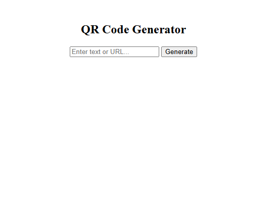
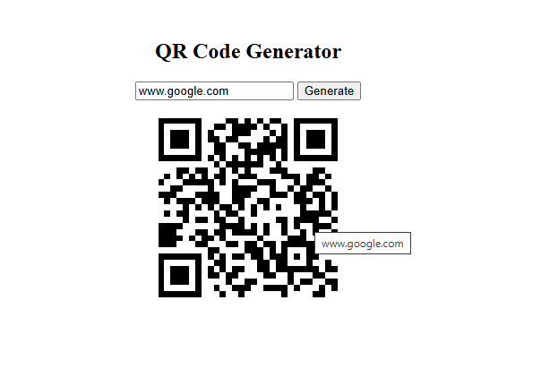

# QR Code Generator

> A modern web application that instantly generates QR codes from text or URLs for quick and easy sharing.


---

# Features

✅ Generate QR codes instantly  
✅ Supports both text and URLs  
✅ Responsive and modern UI  
✅ Dynamic QR rendering  
✅ Beginner-friendly interface  
✅ Fast and lightweight performance  

---

# Screenshots

<p align="center">
  
</p>

<p align="center">
  
</p>

---

# Tech Stack

| Technology | Purpose |
|------------|---------|
| HTML5 | Structure |
| CSS3 | Styling & Responsive Design |
| JavaScript | QR Generation Logic |
| QRCode.js | QR Code Rendering |

---

# Getting Started

## Clone the Repository

```bash
git clone https://github.com/Anurag-3112/qr-code-generator.git
```

## Navigate to the Project

```bash
cd qr-code-generator
```

## Run the Project

Simply open:

```bash
index.html
```

in your browser.

---

# How It Works

1. Enter text or a URL  
2. Click the generate button  
3. Instantly get a scannable QR code  
4. Share or scan the generated QR code  

---

# Project Structure

```bash
qr-code-generator/
│── index.html
│── style.css
│── script.js
│── assets/
│   ├── image1.png
│   └── image2.png
```

---

# Future Improvements

- [ ] QR code download option
- [ ] Custom QR colors
- [ ] QR size selector
- [ ] QR generation history
- [ ] Dark / Light mode
- [ ] Error correction level selector

---

# What I Learned

This project helped me improve my understanding of:

- DOM manipulation
- JavaScript event handling
- Dynamic UI rendering
- External JavaScript libraries
- Responsive frontend development

---

# Contributing

Contributions are welcome!

If you'd like to improve this project:

1. Fork the repository
2. Create a feature branch
3. Commit your changes
4. Open a Pull Request

---

# Author

### Anurag Kumar

Frontend Developer | JavaScript Enthusiast

GitHub: [@Anurag-3112](https://github.com/Anurag-3112)

---

# Support

If you like this project, consider giving it a ⭐ on GitHub!
